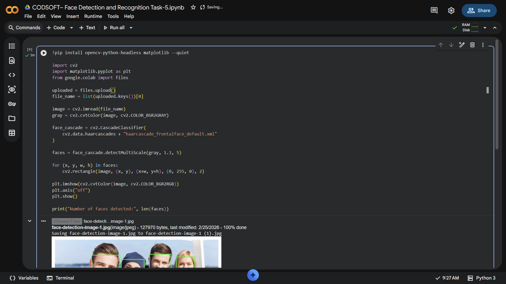

# CODSOFT-Face-Detection-and-Recognition-Task-5
This project was developed as part of the CodSoft AI Internship. The objective of Task 5 is to build a simple face detection system using Python and OpenCV. The program detects human faces in an image using Haar Cascade Classifier and draws bounding boxes around the detected faces.
## 📸 Output Screenshots

### Output 1

### Output 2

